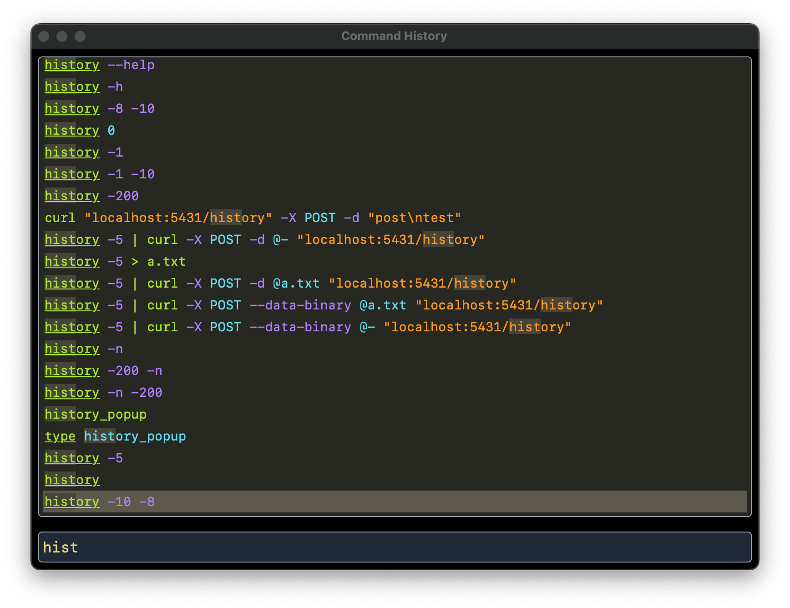
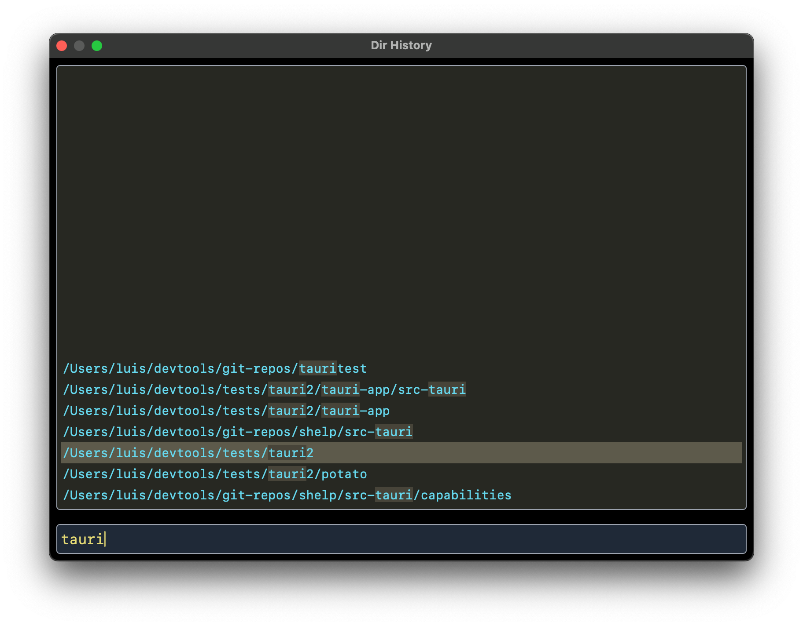
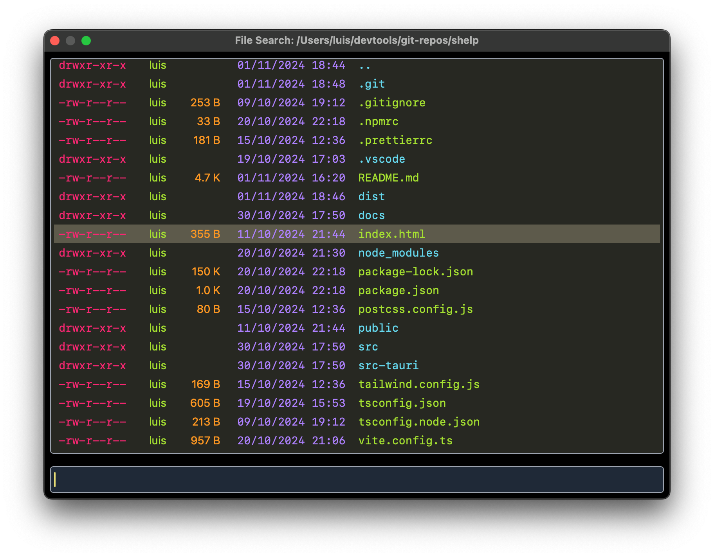

# Shelp

A shell helper popup for **zsh** shells.

## Introduction

Shelp captures certain keys in the shell and opens a popup that lets the user
navigate their command history, change to frequently visited directories,
or select a file via tab-completion.

The key bindings can be changed by modifying `~/.shelp/shelp.zsh`. By default:

- The `PageUp` key opens a command history.
- The `PageDown` key opens a directory history.
- The `Tab` key opens a directory listing.

## Installation

Currently, only a MacOS for Apple Silicon version is available for download. The `.dmg` file
can be downloaded from [here](https://github.com/lcrespom/shelp/releases/download/v0.1.0/shelp_0.1.0_aarch64.dmg).

You can also try the most recent version by cloning this repository and building the code.
It requires node.js to build the UI, and Rust + Tauri to build the application shell.

## Usage

Using Shelp requires two steps:

- Running the Shelp application
- Sourcing `~/.shelp/shelp.zsh` at the start of a session. The easiest way to do
  that is by adding `source ~/.shelp/shelp.zsh` at the end of your `~/.zshrc` file.

File `~/.shelp/shelp.zsh` is automatically created after running Shelp for the first time.

### Command History

In a zsh shell, typing the `PageUp` key will open the Shelp popup and show the most recent commands.
The user can select a command using the keyboard or mouse, and hit `Enter` or click on a history entry
to paste the command to the shell prompt.
A search box is provided, to filter out entries using a fuzzy search.

Example command history in dark mode, filtering entries that contain "hist":

### Directory History

In a zsh shell, typing the `PageDown` key will open the Shelp popup and show the most directories.
The user can select a directory using the keyboard or mouse, and hit `Enter` or click on a directory
entry to change to that directory.

Example directory history in dark mode, filtering entries that contain "tauri":

### Tab completion

In a zsh shell, typing the `Tab` key will open the Shelp popup and show the contents of the current
directory. The user can select a file to copy its name to the command prompt. This is very similar
to the tab-completion feature of the shell, but the user can interactively filter the list of files
and directories. A file or directory is selected by navigating with the keyboard an hitting `Enter`.

If the selected item is a directory, and the mouse is clicked or `Enter` is typed while holding a
modifier key such as `Shift`, `Alt` or `Cmd`, the contents of that directory will be displayed,
letting the user navigate across the directory tree. Additionally, the `Right` key also navigates
into the selected directory, and the `Left` key navigates to the parent directory. This allows for
very fast directory navigation.

Example directory contents in dark mode:

## Settings

Shelp can be personalized by editing the _Configuration_ section at the top of `~/.shelp/shelp.zsh`.
The entries are the following:

- **SHELP_PORT**: HTTP port used by Shelp to listen to commands sent from `zsh`, when the user
  presses some keys such as `PageUp` or `PageDown`. You probably only need to change it if the
  default port number is already in use.
- **SHELP_ALWAYS_ON_TOP**: Set to true if you want the Shelp popup always on top when visible.
  The command prompt remains blocked until the user either selects an item from Shelp popup or
  closes it, for example using the `Esc`.
- **SHELP_THEME**: By default, Shelp applies the system theme. You can manually force "light"
  or "dark" theme.
- **SHELP_WINDOW_SIZE**: Shelp window size, in width x height.
- **SHELP_WINDOW_POS**: Shelp window position. Positive numbers refer to the top left corner,
  negative numbers to the bottom right.
- **SHELP_MAX_HISTORY_LINES**: Maximun number of history lines to get from zsh. Duplicates are
  removed, so the history popup will probably have fewer entries.

## CSS

The look&feel of Shelp can be customized by editing file `~/.shelp/shelp.css`. This file is
automatically created after running Shelp for the first time.
